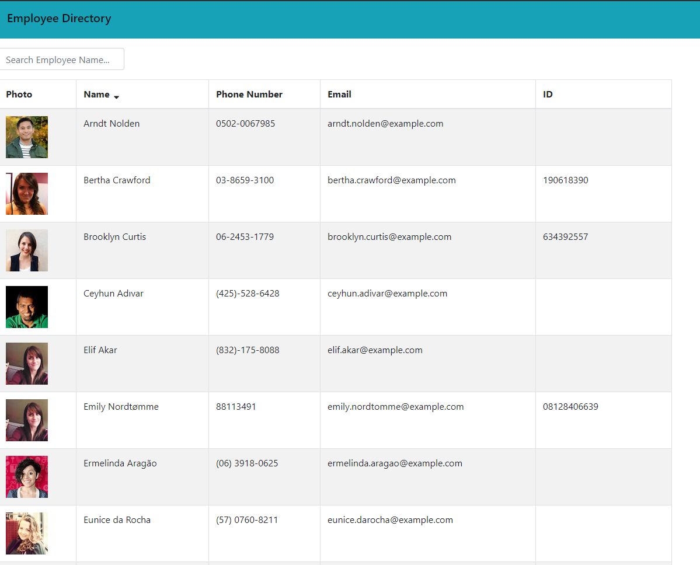
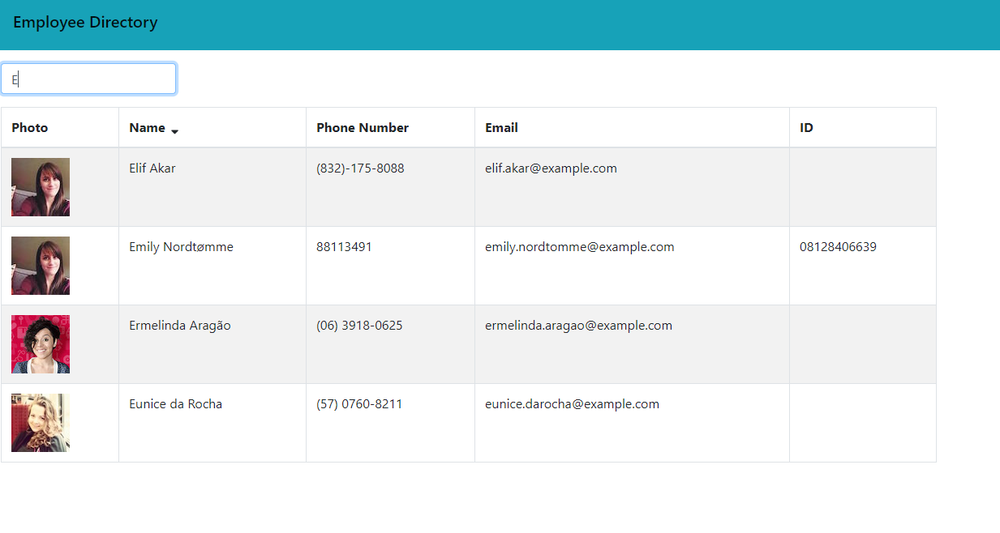
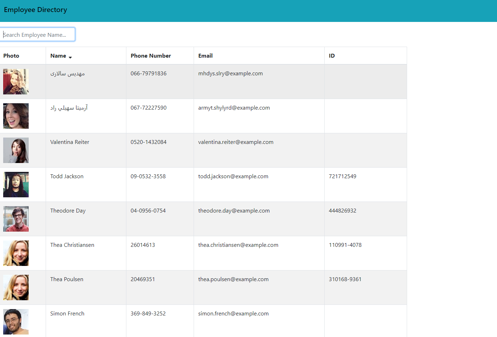

# employee-directory

## Table of Contents

* [Description](#description)
* [Usage](#usage)
* [Credit](#credit)
* [Questions](#questions)

## Description

Employee Directory is a simple way to organize employee information. 30 randomly generated employees appear in the table, along with randomly generated information such as phone number, email, ID, and even a photo. You have the option of searching via name in the search bar or sorting their names in ascending or descending order alphebetically. The random employees come from the Random User API.

## Usage

To access the repo, go to https://github.com/ngkent75/employee-directory

To access the deployed webapp, go to https://ngkent75.github.io/employee-directory/

1. This is what you see when you first pull up the page. 30 employees are generated in total.

2. Click on the search bar and start typing something in. The employees will filter down to whatever you type in dynamically. No search button needed!

3. Clicking on the little arrow next to "Name" will sort the employees in descending order alphabetically by name.

## Credit

Markdown documentation: https://guides.github.com/features/mastering-markdown/#syntax

axios: https://www.npmjs.com/package/axios

bootstrap: https://www.npmjs.com/package/bootstrap

gh-pages: https://create-react-app.dev/docs/deployment/#github-pages

react: https://reactjs.org/

## Questions
Have any questions? Feel free to reach out.

GitHub: [ngkent75](https://github.com/ngkent75)

Email: [ngkent75@gmail.com](mailto:ngkent75@gmail.com)